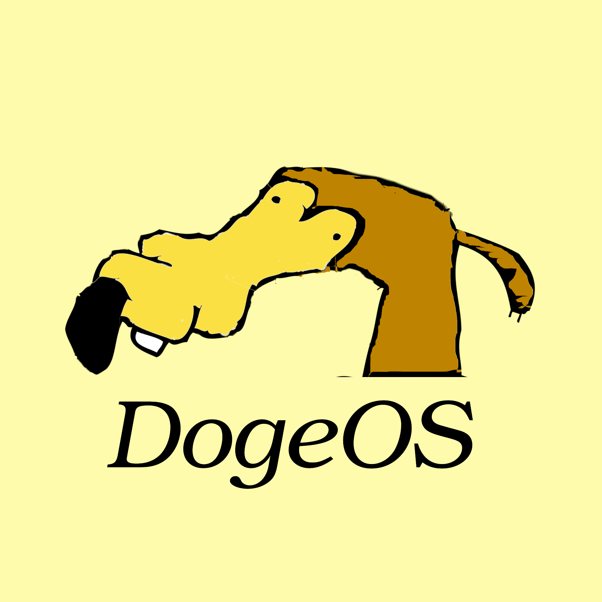
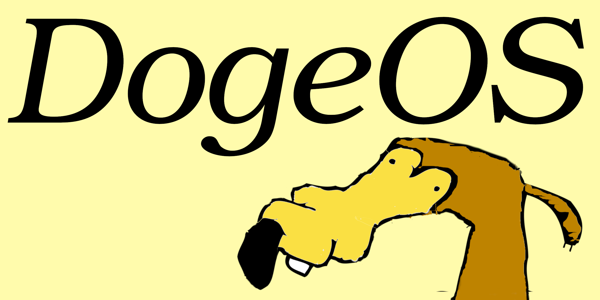

# DogeOS logos

A square logo.

  

An horizontal logo.

  

### License

The Ur is developed by Pellegrino Prevete and released under the
terms of the GNU Affero General Public License version 3.
